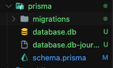

# Prisma🔥

## How to install?

**First of all we gonna using SQLite with local storage for now, After that we try migration to PlanetScale at the last momment**

-   `npm i prisma`
-   `npx prisma init`

```
Next steps:
1. Set the DATABASE_URL in the .env file to point to your existing database. If your database has no tables yet, read https://pris.ly/d/getting-started

2. Set the provider of the datasource block in schema.prisma to match your database: postgresql, mysql, sqlite, sqlserver, mongodb or cockroachdb.

3. Run prisma db pull to turn your database schema into a Prisma schema.

4. Run prisma generate to generate the Prisma Client. You can then start querying your database.
```

## Setup

1. added `.env` into .gitignore file for prevent shown `password`, `id`, `url` `etc` when deploy
2. fixed `DATABASE_URL` inside of `.env` file. most important thing is URL have to be ended with `.db` like below
    ```
    DATABASE_URL="file:./database.db"
    ```
3. we have to tell to prisma like `we don't use postgresql, we gonna use local db instead such as SQLite` like below

    ```
    generator client {
        provider = "prisma-client-js"
    }

     datasource db {
         provider = "sqlite"
         url = env("DATABASE_URL")
     }
    ```

## How to explain to prisma related to db what we created?

-   run `npx prisma migrate dev` like git commit, after the can see the files and forder related to migration
    ```
    ? Enter a name for the new migration: › [name what you want]
    ```
    
